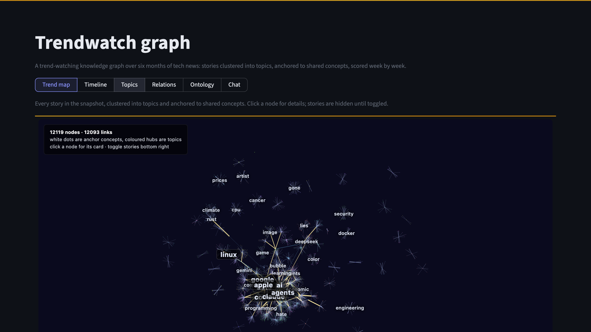
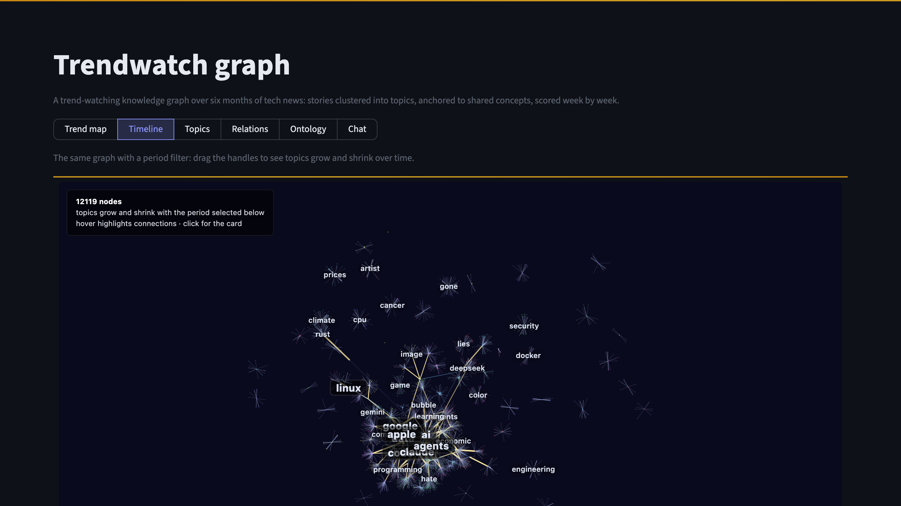
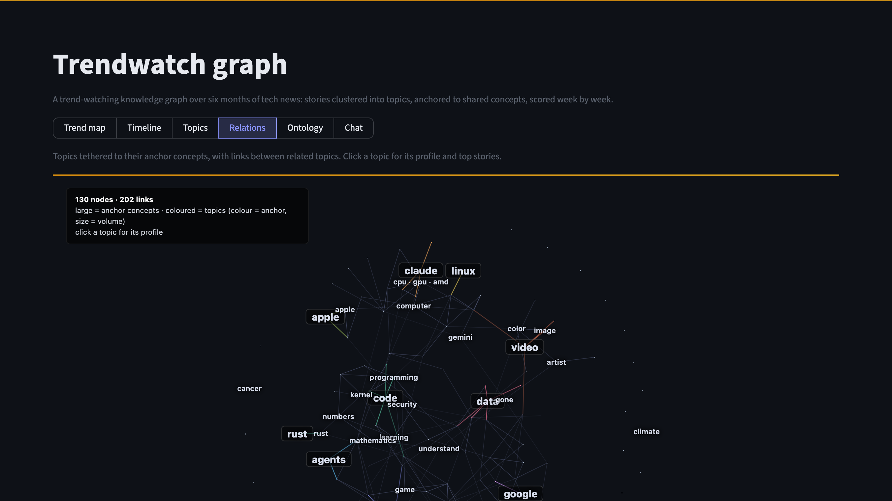
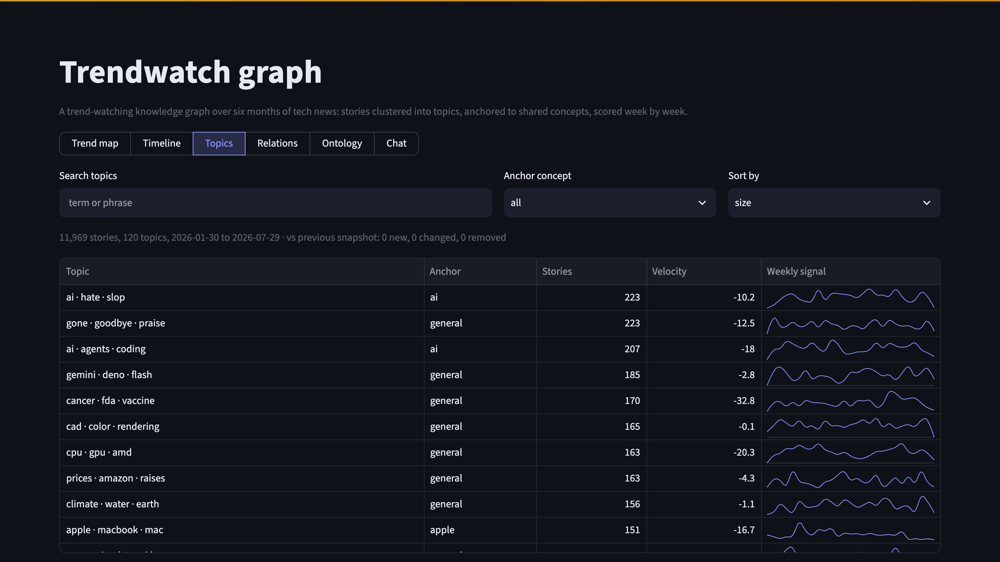
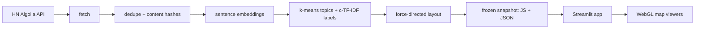

# Trendwatch graph

[](https://github.com/NikNord174/trendwatch-graph/actions/workflows/ci.yml)

An interactive trend-watching knowledge graph over six months of tech news:
11,969 Hacker News stories clustered into 120 topics, tethered to 30 shared
concepts, and scored week by week. I built the whole path myself, from
ingestion and change detection through embeddings, clustering, and layout to
the exploration UI. A frozen snapshot ships in the repo, so it runs anywhere
from a plain pip install: no database, no keys.



| Timeline | Relations | Topics |
|---|---|---|
|  |  |  |

## What you're looking at

- **Trend map** — the full graph: white dots are anchor concepts, coloured
  hubs are topics, stories attach to their topic. WebGL-rendered, click
  anything for its card.
- **Timeline** — the same map with a period filter; topics grow and shrink
  as you drag the date range.
- **Topics** — a searchable table with weekly-signal sparklines and a
  velocity score, plus a per-topic profile and story list.
- **Relations** — topics tethered to their anchor concepts, with links
  between similar topics.
- **Ontology** — the schema behind the graph and the snapshot's
  change-detection counters.
- **Chat** — questions answered over the snapshot: lexical retrieval picks
  topics and stories, an LLM writes the answer if a key is configured
  (without one the tab degrades to plain retrieval).

## How it works



The app is snapshot-first on purpose: everything it needs ships in the repo,
so a clone cannot rot when a free-tier database pauses. The pipeline that
produced the snapshot is in `pipeline/` and can rebuild it at any time.

## Run it

Needs Python 3.11 or newer.

```
git clone https://github.com/NikNord174/trendwatch-graph
cd trendwatch-graph
pip install -r requirements.txt
streamlit run app.py
```

Or with Docker: `make docker-build && make docker-run`, then open
http://localhost:8501. The map viewers load one rendering module from a CDN,
so viewing the maps needs internet.

## Rebuild the data

```
make install-pipeline
make data
```

`pipeline/fetch.py` pulls the last 180 days of stories with 50+ points from
the keyless Algolia HN API; `pipeline/run.py` deduplicates them by normalized
content hash, embeds titles locally (all-MiniLM-L6-v2), clusters with k-means,
labels clusters c-TF-IDF style, lays the graph out with Fruchterman-Reingold,
and writes the snapshot. Each run diffs its hash set against the previous
snapshot, so the Ontology tab can report exactly which stories are new or
changed — the same mechanism an incremental ingest would use against a
database, applied to flat files.

## Design notes

- **Signal model.** A story contributes `tier_weight x (1 + log10(points/50))`
  to its topic's week: source quality times log-damped attention, so one viral
  story cannot drown a quarter of steady coverage. Velocity is the last four
  weeks minus the four before.
- **Source tiers.** Domains are ranked 1-4 (primary sources, established
  press, blogs, social/aggregators) by a small curated table. Crude, but
  honest and easy to audit.
- **Precomputed layout.** The force simulation runs offline; the viewers get
  final coordinates and keep the GPU for rendering only, which is why 12k
  nodes stay smooth.
- **One section per rerun.** Each map inlines a multi-megabyte data bundle,
  so the app renders one section at a time instead of embedding all maps at
  once.

## Tests

`make test` — 45 pytest cases: the pure pipeline functions (hashing, snapshot
diff, clustering helpers, the signal model, chat retrieval ranking) and
integrity checks over the committed snapshot itself (links resolve, dates
parse, hashes recompute, no orphaned concepts). Streamlit glue is
deliberately untested.

## Data and licensing

Story metadata (title, link, score, date) comes from the public
[Algolia Hacker News API](https://hn.algolia.com/api); all linked content
belongs to its original publishers. The snapshot is frozen at 2026-07-29.
Maps are rendered with [Cosmograph](https://cosmograph.app)
(`@cosmograph/cosmos`, CC-BY-NC-4.0, loaded from CDN). Code is MIT.

## Limitations

- k-means always leaves a few incoherent clusters. They are visible in the
  Topics table and I kept them; hiding a model's failure modes would
  misrepresent it.
- Velocity over a frozen snapshot is illustrative; in live operation it
  would be recomputed on every refresh.
- Concept extraction is document-frequency based, so anchors skew toward the
  vocabulary HN favours.
